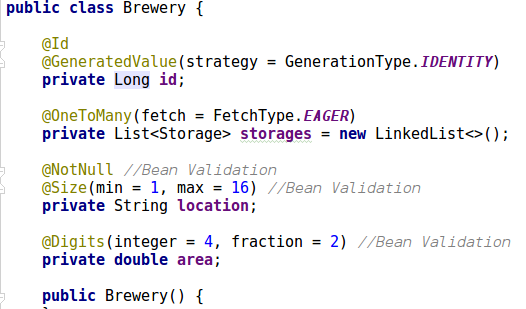
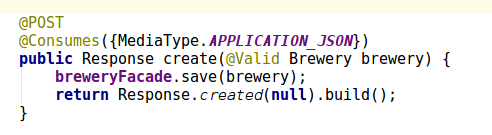
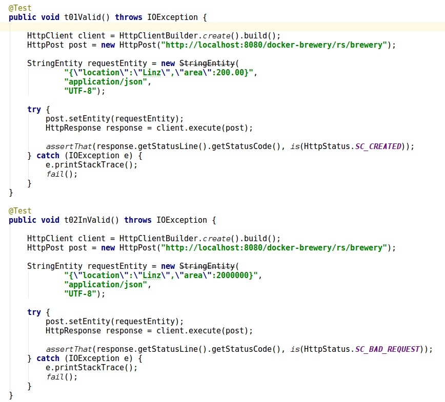
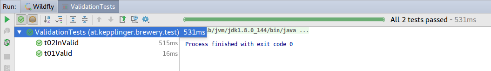

# Kepplinger -- Übung Bean Validation

### Was ist Bean Validation
Bean Validation wird benutzt um die Werte von Feldern in Klassen zu überprüfen.  
Dies wird mithilfe von setzen bestimmter Annotationen über den Feldern erzielt.  

**Beispiel:**
```
public class Name {
    @NotNull
    @Size(min=1, max=16)
    private String firstname;

    @NotNull
    @Size(min=1, max=16)
    private String lastname;
    ...
}
```
### Brewery-Validation

- Zuerst wurden die **Validation-Annotationen** hinzugefügt:


- Danach wird eine **REST-Schnittstelle** defniniert:


- Anschließend werden 2 **Tests** erstellt:


- Wenn diese erfolgreich sind hat alles funktioniert:

