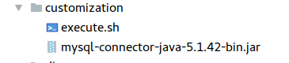

# Kepplinger -- Übung JEE in Docker  

### 1.Projekt erstellen  
Java EE Maven Projekt anlegen mit:
   - Entitäten
   - InitBean
   - index.xhtml
   - IndexController

### 2. Datenbank erstellen

- **db** Ordner anlegen
- **create.sql** anlegen:

```sql
CREATE DATABASE keppidb;
CREATE USER 'brewery' IDENTIFIED BY 'passme';
GRANT ALL ON keppidb.* TO 'brewery';
```

- **Dockerfile** anlegen:

```
FROM mysql/mysql-server

ENV MYSQL_ROOT_PASSWORD=passme

COPY create.sql /docker-entrypoint-initdb.d
```
- das Image mit `docker build -t mysql .` **builden**:


- die Datebank mit `docker run --name mydb -p 3306:3306 mysql` **starten**:


Die Datenbank is nun lauffähig und kaun über `jdbc:mysql://localhost:3306/keppidb`
erreicht werden.

### 3.Projekt deployen
- **Dockerfile** anlegen

```
FROM jboss/wildfly:latest

RUN /opt/jboss/wildfly/bin/add-user.sh admin passme --silent

COPY customization /opt/jboss/wildfly/customization

COPY target/docker-brewery.war /opt/jboss/wildfly/customization/docker-brewery.war

CMD ["/opt/jboss/wildfly/customization/execute.sh"]
```

- **customization** Ordner erstellen
- **execute.sh** hineinkopieren
- **mysql-connector-java-5.1.42-bin.jar** hineinkopieren:

- ip mit `docker inspect mydb` herausfinden
- ip in der execute.sh einfügen:

```
MYSQL_CONTAINER_PORT_3306_TCP_ADDR=172.17.0.3
MYSQL_CONTAINER_PORT_3306_TCP_PORT=3306
MYSQL_DATABASE=keppidb
MYSQL_USER=brewery
MYSQL_PASSWORD=passme
```

- wildfly builden:


- wildfly ausführen:


Die Anwendung ist nun deployed und kann über `http://localhost:8080/docker-brewery` aufgerufen werden.

### 4. Docker Compose
- Im Project-Root ein **docker-compose.yml** File anlegen:
```
version: '3'
services:
  wildfly:
    build: .
    ports:
      - 8080:8080
    depends_on:
      - db
  db:
    build: ./db
    ports:
      - 3306:3306
```

- Dann mithilfe von `docker-compose build` alles builden:


- Schließlich alles mit `docker-compose up` ausführen:


- Die Anwendung ist nun deployed und kann über `http://localhost:8080/docker-brewery` aufgerufen werden:

